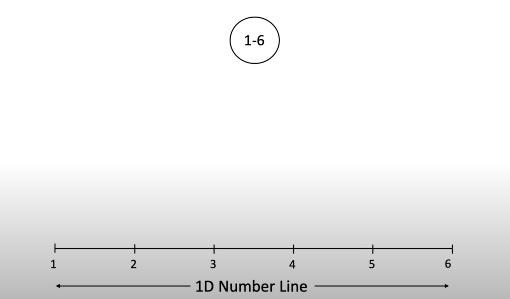

# 1D
# Binary Search Tree vs HashMap
Following are two general approach
- Hash Table: Requires that keys can be hashed
- Search Tree: Requires that keys can be compared
    - BST maintain the order
    - Minimum item in BST can be find in O(log n)
    - Minimum item in HashMap can be find in O(n)
    - Easy to modify BST to give rank of item, i.e. give me 5th largest item etc
    - With hash map, it would be O(n)
    - AVL trees, splay trees, 2-3 Trees, B-trees, and tries are optimized designed for searching on a one-dimensional key. 

Following are two special case implementations
- Data index array: Requires that keys are small
- Trie: Requires that keys are string

## Binary Search Tree for 1D point



- Binary search tree is cleaver and efficient structure for decomposing 1D point information

Following are typical questions asked
- Nearest point
- find points for given range

# 2D
- Multi dimensional hash map
```
my %company = ('Sales' =>    { 
                                'Brown' => 'Manager', 
                                'Smith' => 'Salesman', 
                                'Albert' => 'Salesman',  
                            },  
            'Marketing' =>  { 
                                'Penfold' => 'Designer', 
                                'Evans' => 'Tea-person', 
                                'Jurgens' => 'Manager',  
                            }, 
            'Production' => { 
                                'Cotton' => 'Paste-up', 
                                'Ridgeway' => 'Manager', 
                                'Web' => 'Developer',  
                            }, 
            ); 
```
## Motivation
### Multidimensional range queries
- Multidimensional range queries are the defining feature of a spatial application.
- Because a coordinate gives a position in space, it is called a spatial attribute.
- To implement spatial applications efficiently requires the use of a spatial data structure. 
- Spatial data structures store data objects organized by position and are an important class of data structures used in geographic information systems, computer graphics, robotics, and many other fields.

- 2D range search: How many objects are in the highlighted rectangle?

### Nearest
- What is closest object to a specific point?
- Can be generalize to k nearest
- Nearest neighbors: What is the closest object to the space horse?


## solution?
This can be solve using following
- HashTable approach
- BST approach

## Hash code approach
- Suppose the set is stored as hash table
- where hash code each body is given below
    - How would nearest point will be implemented?
    - How would be the runtime of nearest?
```
hashCode pseudoCode:
    return xPos.hashCode() * pow(31,4) + yPos * pow(31,3) + 
            xVel.hasCode() * pow(31,2) + yVal.hasCode(31,1) +
            mass.hasCode()
```
    - The bucket that each object is effectively random
    - Have to iterate overall N items
- What would be the runtime of nearest?
    - log n
## Uniform Partitioning
- Create buckets of contiguous region of space
- For example, sub divide space into 16 different regions
- these buckets is also known as bin
- This ensure that bucket hash depends only on position
- Typical implementations would have the container itself compute a bucket number
    - Don't use object's hashCode()
    - Each object provides getX() and getY()
- This is sometime called spatial hashing
 
Questions:
- How many points needs to be examined for the called nearest()?
    - 3 points in cell 1
- White bucket do we need to iterate over to find all points in the green range?
    - 5, 6, 9 & 10


- What would be runtime?
    - O (N)
https://www.youtube.com/watch?v=Ua7vmGcY3Qg

## Use of two BSTs
- Separate BSTs could be used to index the x and y coordinates.
- This would allow us to insert and delete cities, and locate them by name or by one coordinate. `
- However, search on one of the two coordinates is not a natural way to view search in a two-dimensional space.
- Also, two BST loose the order of items

Following is BST using x co-ordinate


Question: Can you search for x co-ordinate less than -1.5? (Range query)

Following is BST using y co-ordinate

Question: Can you search for x co-ordinate less than -1.5? (Exact same range query)
- Choice of which dimension to use for search makes big difference.
https://www.youtube.com/watch?v=VC1kZ42XCkY
https://www.youtube.com/watch?v=vGRyb1fK-bg


## Quad tree
- The `PR quadtree` uses `key-space decomposition` and so is a form of `trie`. 
- It is a binary tree only for one-dimensional keys (in which case it is a trie with a binary alphabet).
- For d dimensions it has 2d branches.
- Thus, in two dimensions, the PR quadtree has four branches (hence the name "quadtree"), splitting space into four equal-sized quadrants at each branch. 

- Every nodes has four child for all four direction
    - NE
    - NW
    - SE
    - SW
Demo #1:


Demo #2:


QuadTree is also spatial partitioning in disguise
 - Uniform partitioning approach is perfect grid of rectangles
 - QuadTree is hierarchial partitioning. Each own 4 subspaces. 
    - Space is more finely divided into region where there are more points
    - Results in better runtime in many circumstances


Point Region QuadTree for image


- construction algo is called bottom up neighbor findings
https://www.youtube.com/watch?v=OJxEcs0w_kE

# 3D Data
Suppose we want to store objects in 3D data
- Quadtree only have four directions, but in 3d, there are 8
- So can't use QuadTree

## OctTree
- Very widely used in practice
- Similar to quad tree
- Each node will have 8 children
## K-d tree
- Arbitrary number of dimensions 
    - k-d means k dimensions
- A number of spatial data structures are used for storing point data in two or more dimensions. 
- The `kd tree` is a natural extension of the `BST` to multiple dimensions. 
- It is a binary tree whose splitting decisions alternate among the key dimensions. 
- Like the `BST`, the `kd` tree uses `object-space decomposition`.     
### Example
Database of songs, we want to find songs as per below dimensions
- 3 and 6 mins of length
- 1000 and 20,000 listens i.e. popularity
- Between 120 to 150 BPM (beats per minute i.e. speed)
- Were recorded after 2004
### Use k-d tree to solve this
### Use 2D data to understand k-d i.e. k = 2
- Root node partitions entire space into left and right (by x)
- All depth 1 nodes partition subspace into up and down (by y)
- All depth 2 nodes partition subspace into left and right (by x)
- I.e. it will keep alternating between x and y for every even/odd depth
- In 3D, it will alternate by x, y, z 
- In 4D, it will alternate by w, x, y, z

### Insertion

### Why k-d is useful?
- Same ideas as quad tree
- each nodes contains several subspace
- QuadTree has four subspace
- kd tree has 2 subspace
### Run k-d nearest 
Each point owns two subspaces
- Similar to quad tree
- Example: `D` owns two subspaces shown
    - The top subspace is infinitely large


- We want to find nearest ((0,7))
- Can visually see the answer is (1,5)


- First look for good side
- Check if looking at bad side can give me better? 
    - if yes then explore bad side as well

https://www.youtube.com/watch?v=vGRyb1fK-bg
https://www.youtube.com/watch?v=D6nrGYfnWFI

# Leetcode problems
https://leetcode.com/problems/construct-quad-tree/
https://leetcode.com/problems/logical-or-of-two-binary-grids-represented-as-quad-trees/

# Reference 
https://www.youtube.com/watch?v=uHronVrSSdw
https://www.youtube.com/watch?v=_NY_1tCOuis
https://www.youtube.com/watch?v=qH2-xwUz3tU
https://www.youtube.com/watch?v=xFcQaig5Z2A&t=197s